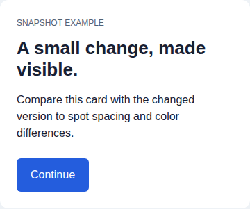
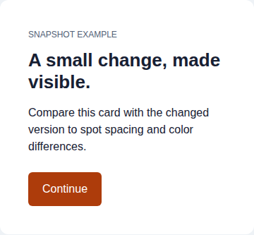
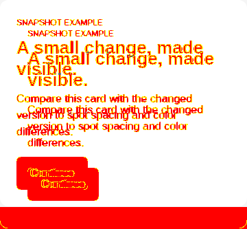

# Elle Snapshot

Local visual evidence for humans and coding agents: capture a web page or component,
export a Figma selection, and compare snapshots with a pixel diff and readable report.
No hosted service, API key, or AI subscription required. Independent of Ellemonade.

**Status: early preview.** Scores are review aids, not proof of design compliance.
The Figma integration is a development plugin, not a published Community plugin.

## Install from source

Prerequisites: **Bun 1.4.2+** and Git (or a downloaded source archive).
Install [Bun](https://bun.sh/) using its official installer, then:

```bash
git clone https://github.com/dna113p/elle-snapshot.git
cd elle-snapshot
bun install --frozen-lockfile
bun x --bun playwright install chromium
bun run check
bun bin/elle-snapshot.js --help
```

On Linux, missing browser system libraries can be installed with
`bun x --bun playwright install --with-deps chromium` (may require administrator access).
The browser is only needed for `capture-url`, the demo, and browser tests.
**Node.js and npm are not required.** The CLI executes TypeScript directly in Bun;
`--bun` keeps third-party setup commands on the same runtime. Bun 1.4.2 is pinned
for CI, including Windows Chromium-launch fixes absent from older Bun versions.

Optional: expose `elle-snapshot` on your PATH:

```bash
bun link
elle-snapshot --help
```

Ensure Bun's global bin directory is on PATH. If a different installation shadows
that command, use `bun /path/to/elle-snapshot/bin/elle-snapshot.js` directly.
Keep this checkout in place: the linked command runs its source files.
There is no npm-registry release; `private: true` prevents accidental publication.

## Try it without an app

After installing dependencies and Chromium, run this from the Elle Snapshot checkout:

```bash
bun run demo
```

The demo captures two [bundled HTML cards](examples/basic/): a baseline and a version
with intentionally changed padding and button color. No server, Figma file, or
external website is needed. It prints paths under a fresh `.snapshots/demo/<timestamp>/`
directory for:

```text
baseline/01-card.png         Original component
current/01-card.png          Intentionally changed component
comparison/diff.png          Highlighted pixel differences
comparison/compare.report.md Human-readable findings
```

Example output from the bundled cards:

| Baseline | Changed | Pixel diff |
| --- | --- | --- |
|  |  |  |

The report identifies the padding change (`24px` → `40px`), changed button background,
and changed component height, alongside screenshot and DOM/style scores.

Open those images and the report. A `needs-work` or `fail` verdict is **expected**;
the demo exits 0 when capture and comparison complete. The example script uses the
same capture/compare functions as the CLI. The next section shows the CLI commands
for your own app. Run `bun run demo --help` for an optional output-directory flag.

## Install the agent skill

The repository includes one self-contained [Elle Snapshot skill](skills/elle-snapshot/SKILL.md)
covering capture, PNG/Figma references, comparison, and the visual feedback loop.
It teaches the agent how to use the tool; it **does not install the CLI or Chromium**.

Use the [Agent Skills installer](https://github.com/vercel-labs/skills) directly from GitHub:

```bash
# Preview discovery without installing anything.
bun x --bun skills add dna113p/elle-snapshot --list

# Install for your user; choose your coding agent when prompted.
bun x --bun skills add dna113p/elle-snapshot --skill elle-snapshot --global
```

To install only into a project, run from that project's directory and omit
`--global`. To install from a local checkout, replace `dna113p/elle-snapshot` with
its absolute path (or `.` when running in that checkout). To target an agent
explicitly, add e.g. `--agent claude-code` or `--agent codex`. Review the install
prompt if a skill with the same name already exists. Restart/reload your agent as
required by its skill-discovery mechanism.

No installer required: copy the entire `skills/elle-snapshot/` directory into your
agent's supported skills directory, or ask it to read `SKILL.md` directly. The skill
has no dependencies on other files in this repository, so a copied skill stays usable.

### Symlink instead of copying

On macOS/Linux, a symlink keeps the installed skill in sync with this checkout.
Run this from the Elle Snapshot repository root. This example installs for **Pi**;
for Claude Code or Codex, change `skills_dir` to `$HOME/.claude/skills` or
`$HOME/.codex/skills` respectively.

```bash
skills_dir="$HOME/.pi/agent/skills"
source_dir="$(pwd -P)/skills/elle-snapshot"
target="$skills_dir/elle-snapshot"

if [ ! -f "$source_dir/SKILL.md" ]; then
  printf 'Run this from the Elle Snapshot repository root.\n'
elif [ -e "$target" ] || [ -L "$target" ]; then
  printf 'Already exists; inspect before replacing: %s\n' "$target"
else
  mkdir -p "$skills_dir" && ln -s "$source_dir" "$target"
fi
```

Keep the checkout at that location, then restart/reload the agent. In Pi, invoke
`/skill:elle-snapshot` to load it explicitly. If another skill with the same name
is already installed, choose which one to keep rather than creating competing copies.
The link installs only the instructions, not the CLI or browser dependencies.

### Example request

After installing the tool and skill:

> Use the elle-snapshot skill to capture `#app` at `http://localhost:5173` at
> 1440×900, compare it against my reference PNG, inspect the images and diff,
> and report the largest visual mismatches. Do not change application code yet.

## First capture and comparison

With your application running at `http://localhost:5173`, replace the URL and selector
below with a real page and component. Commands assume the optional CLI link above.

```bash
# Capture a baseline before changing your application.
elle-snapshot capture-url --url http://localhost:5173 \
  --selector '#app' --label baseline \
  --viewport-width 1440 --viewport-height 900 \
  --output-dir .snapshots/baseline

# After making a change, capture the same viewport and application state.
elle-snapshot capture-url --url http://localhost:5173 \
  --selector '#app' --label current \
  --viewport-width 1440 --viewport-height 900 \
  --output-dir .snapshots/current

elle-snapshot compare \
  --source .snapshots/baseline/capture.bundle.json \
  --target .snapshots/current/capture.bundle.json \
  --source-asset selector-1 --target-asset selector-1 \
  --output-dir .snapshots/comparison
```

Open `compare.report.md`, `diff.png`, and both source images. Fix the most important
unintentional discrepancy, capture into a **new** directory, and compare again.
Use a baseline for regression checks; use an approved design for design compliance.

### Compare against an existing PNG

```bash
elle-snapshot bundle-image --image reference.png --label reference \
  --output-dir .snapshots/reference

elle-snapshot capture-url --url http://localhost:5173 \
  --selector '#app' --viewport-width 1440 --viewport-height 900 \
  --output-dir .snapshots/current

elle-snapshot compare \
  --source .snapshots/reference/capture.bundle.json \
  --target .snapshots/current/capture.bundle.json \
  --source-asset image --target-asset selector-1 \
  --output-dir .snapshots/comparison
```

PNG is the only image format supported. `--match-size <png-or-bundle>` sets the
**browser viewport**, not the component dimensions. A cropped component reference
usually needs an explicit page viewport instead. Bundle size matching uses the
first comparable asset (normally the full-page image), not `selector-1`.

## Command behavior

Run `elle-snapshot --help` for all flags.

- `capture-url` always captures `page`, then `selector-1`, `selector-2`, etc. for
  repeated `--selector` options. Each selector captures its **first** match.
  Missing selectors are recorded in the bundle and make the CLI exit 1.
- Full-page capture is the default; `--viewport-only` limits the page image.
- Asset selection accepts an exact key, label, or selector. Unknown, ambiguous, or
  unmatched explicit assets fail rather than silently comparing something else.
  With no asset option, the first matched screenshot is used.
- Output directories can overwrite earlier artifacts. Use a fresh directory for
  every iteration. Figma exports automatically get unique directories.
- Comparison writes `diff.png`, `compare.report.json`, and `compare.report.md`.
  Different image sizes never receive a `pass` verdict.
- Comparison is **report-only by default**. Add `--fail-on-diff` for automation:
  exit 0 = pass; exit 2 = needs-work/fail; exit 1 = invalid input or runtime error.
  This gate uses the documented verdict thresholds, **not exact pixel equality**.

For metric definitions, path rules, and limitations, see [comparison and bundles](docs/comparison.md).

## Figma → local snapshot

1. In this checkout, run `bun run figma:build`.
2. In Figma Desktop, choose **Plugins → Development → Import plugin from manifest**
   and select this checkout's `figma-plugin/manifest.json`.
3. In your application directory, start:
   `elle-snapshot figma-receive --output-dir .snapshots/figma`.
4. Run the **Elle Snapshot** development plugin. Paste the **receiver token** printed
   in the terminal into its token field. It is not saved to local storage.
5. Select one node; optionally set an export name and context; click **Send selection**.
6. The terminal/plugin shows the bundle location. Compare its `image` asset against
   a browser selector capture. Keep the PNG, bundle, metadata and design evidence together.

The receiver binds only to `127.0.0.1:4317` and requires a per-session bearer token.
Keep the terminal open while exporting; stop it with Ctrl+C when done. A restart
creates a new token. Only the first selected node is exported, at 1× scale.

`--port` is available for custom receivers. The supplied plugin and its development
network allowlist use port 4317; using another port requires changing both
`figma-plugin/ui.html` and `figma-plugin/manifest.json`. Do not expose the receiver
through a public proxy or tunnel.

## Sharing artifacts and privacy

New bundles use relative artifact paths: copy the **entire capture directory**.
For a report with references to two bundles, preserve the directory layout containing
all three. Old absolute-path bundles remain readable on their original machine;
recapture/import them for portable sharing. There is no automatic legacy migration.

Snapshots can contain private page text, DOM snippets, URLs/query parameters, and
Figma design details. Review them before sharing. Generated snapshot directories
are ignored by this repo, but add equivalent exclusions in your application repo.
See [security](SECURITY.md) before capturing authenticated/private content.

For an agent-operated feedback loop, see [the agent workflow](docs/agent-workflow.md).

## Troubleshooting

| Symptom | Action |
| --- | --- |
| `bun` not found | Install Bun and ensure it is on PATH; the CLI runs directly with Bun. |
| Chromium executable missing | Run `bun x --bun playwright install chromium` from this checkout. |
| Linux browser dependencies missing | Run the `--with-deps` install command above. |
| Missing selector or timeout | Verify the URL/state and selector; increase `--wait-after-load-ms` for delayed content. |
| Login page captured | Capture a locally accessible test page or use your own trusted local proxy. Auth-state injection is not implemented. |
| Plugin reports 401 | Paste the token from the currently running receiver. |
| Plugin cannot connect | Start the receiver on the same machine as Figma Desktop; verify port 4317 is free. |
| Port already in use | Stop the old receiver or the conflicting process. |
| Export too large | Select a smaller node: requests are capped at 20 MiB and decoded PNGs at 40 million pixels. |
| Bundle fails after moving | New bundles need sibling artifact files; legacy absolute paths require recapture. |

## Development

```bash
bun run test          # Image, CLI, and receiver tests; no browser required
bun run test:browser  # Chromium capture integration tests
bun run validate     # Type checks, both suites, and plugin build
```

CI is configured to run this sequence on Linux, macOS and Windows. Tests generate their own images
and temporary directories; no private fixtures or live-site access are needed.
See [contributing](CONTRIBUTING.md) and the [release checklist](docs/releasing.md).

## License

A public-release license has **not yet been selected**. `UNLICENSED` is an explicit
placeholder, not an open-source license. The owner must add an approved `LICENSE`
and update `package.json` before releasing this as an open-source project.
